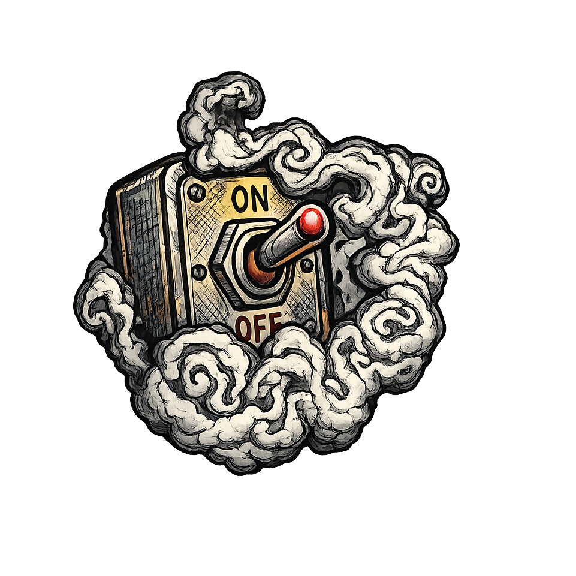

  

<h1 align="center">Fog Switcher</h1>

  A lightweight Windows utility for checking Dead by Daylight region status and managing region locks through the Windows hosts file.

## Overview

Fog Switcher is a desktop companion for players who want a simple way to inspect available Dead by Daylight regions and control which ones remain reachable from Windows.

The app combines live latency checks, queue estimates, and a focused region-lock workflow in a single interface. It is designed to stay usable without administrator rights for browsing region information, and only asks for elevation when a hosts file change is required.

## What the app does

- Measures latency across the main Dead by Daylight regions with a color-coded status.
- Displays estimated killer and survivor queue times.
- Lets you keep one or more preferred regions enabled.
- Writes a dedicated Fog Switcher block to the Windows `hosts` file to block other regions.
- Removes only the entries created by Fog Switcher when you clear the selection.
- Checks GitHub Releases at startup and can offer a newer version when one is available.

## How it works

Fog Switcher retrieves region and queue information from the public Dead by Queue API, then uses your selection to update a managed section of the Windows `hosts` file.

That means the application does not overwrite the whole file. It only maintains its own block, which helps keep existing custom entries untouched.

## Data source

- Queue and region data: `https://api2.deadbyqueue.com/`

Fog Switcher is an independent project and is not affiliated with Behaviour Interactive or Dead by Queue.

## Windows permissions

Reading region information does not require administrator rights.

Administrator elevation is only requested when Fog Switcher needs to write to `C:\Windows\System32\drivers\etc\hosts`.

## Release variants

GitHub Releases can provide two Windows download variants:

- `framework-dependent` package: a smaller `.zip` that contains the app files and requires the matching .NET Desktop Runtime to already be installed on the machine.
- `self-contained` executable: a larger standalone `.exe` that includes the required .NET runtime and is easier to run on a machine that does not already have it installed.

When a release contains multiple valid download assets, Fog Switcher opens the release page so the user can choose the package that fits their system.
